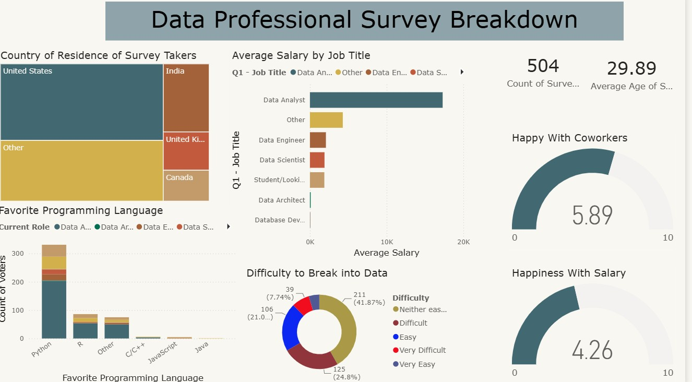

# Data Analytics Portfolio
# Project 1

**Title:** [Car Sales Data Dashboard](https://github.com/sfrempong35-maker/sfrempong35-maker.github.oi/blob/main/Car_saless.xlsx)

**Tool Used:** Microsoft Excel (Pivot Tables, Conditional Formatting, Slicer, Timelines, Pivot Charts)

**Project Description:** This project analyses car sales performance using a dataset containing 23,906 vehicle sales records across 2022 and 2023, with total revenue of $671.5 million. The analysis explores sales trends by year, car company, dealer, gender, transmission type, colour, and body style. I cleaned and structured the dataset, then built pivot-based summaries and an interactive dashboard to highlight key business insights. The dashboard shows top-performing car companies, leading dealers, customer purchase patterns, and yearly sales growth. Key findings include higher total sales in 2023 compared with 2022, strong performance from brands such as Chevrolet and Ford, and higher revenue from automatic transmission vehicles.This project demonstrates skills in Excel data cleaning, pivot tables, dashboard design, sales analysis, data visualisation, and business insight reporting.

**Key findings:** The dataset contains 23,906 car sales records, with total sales revenue of $671.5 million and an average sale value of about $28,090. Sales increased from $300.3 million in 2022 to $371.2 million in 2023, showing growth of about 23.6%. Chevrolet generated the highest revenue at $47.7 million, followed closely by Ford at $47.2 million and Dodge at $44.1 million. Rabun Used Car Sales was the top-performing dealer, generating $37.5 million from 1,313 sales.

Automatic transmission vehicles performed slightly better than manual vehicles, generating $355.1 million, about 52.9% of total revenue.
Male customers accounted for the largest share of sales, contributing $527.1 million, about 78.5% of total revenue.
Pale White was the most popular vehicle colour by revenue, generating $309.4 million. SUVs produced the highest revenue by body style, with $170.6 million in sales, followed by Hatchbacks at $166.2 million.Austin was the strongest dealer region, generating $117.2 million, about 17.5% of total revenue.

**Dashboard Overview:**

# Project 2
**Title:** Pizza Sales Data Interrogation

**SQL Code:** [Pizza Sql  Queries](https://github.com/sfrempong35-maker/sfrempong35-maker.github.oi/blob/main/PIZZA.Sql)

**SQL Skills Used:** Data Retrieval (SELECT): Queried and ectracted specific information from database.

Data Aggregation (SUM, COUNT): Calculated totals, such as sales and quantities, and counted records to analyze data trends.

Data Filtering (WHERE, BETWEEN, IN , AND, GROUP BY): Applied filtrs to slelect relevant data, including filtering by ranges and lists.

Data Source Specification (FROM): Specified the tables used as dara sources for retrieval.

**Project Description:** This project involved analysing a pizza sales dataset using Microsoft SQL Server to extract business insights from customer orders, sales revenue, pizza categories, sizes, and pricing.

The dataset contained key fields such as pizza ID, order ID, pizza name, quantity, order date, order time, unit price, total price, pizza size, pizza category, and pizza ingredients. SQL queries were written to calculate total revenue, total pizzas sold, total number of orders, and sales performance for specific pizza categories and products.

The analysis also explored date-based sales trends, including pizzas ordered in January 2015 and orders placed between November and December 2015. Product-specific queries were used to measure the quantity sold for selected pizzas such as The Hawaiian Pizza, The Greek Pizza, and The Spinach Supreme Pizza. Additional filtering was applied to identify medium-sized pizzas and pizzas with a unit price above 12.5.

This project demonstrates practical SQL skills, including data selection, aggregation, filtering, grouping, date range analysis, and business reporting. The insights produced from the analysis support a better understanding of sales performance, customer purchasing patterns, and product demand within the pizza business.

**Technology Used:** SQL Server

# Project 3

**Title:** Salesman Customer Order Data Inerrogation

**SQL CODE:** [Salesman Customer Order Data](http://github.com/sfrempong35-maker/sfrempong35-maker.github.oi/blob/main/Salesman%20Customer%20Order%20Data%20SQL)

**SQL Skills Used:** Data Retrieval (SELECT): Queried and extracted specific information from database.

Data Aggregation (SUM, COUNT, JOIN, LEFT JOIN, RIGHT JOIN): Calculated totals, such as sales, quantities, counted records and also joining tables to analyze data trends.

Data Filtering (WHERE, BETWEEN, IN , AND, GROUP BY, ORDER BY): Applied filters to select relevant data, including filtering by ranges, lists, grouping data and ordering data.

Data Source Specification (FROM): Specified the tables used as dara sources for retrieval.

**Project Description:** This project involved analysing sales, customer, and order data using Microsoft SQL Server. The aim was to explore relationships among salespeople, customers, cities, commissions, and purchase orders to produce useful business reports.

The analysis used three main tables: Salesman, Customer, and Order. SQL joins were used to connect salespeople to their assigned customers and to match customer records to order details. The queries identified salespeople and customers living in the same city, orders with purchase amounts between 500 and 2000, customers represented by specific salespeople, and salespeople earning commission above 12 per cent.

Further analysis focused on customer and salesperson location differences, order details, customer grades, and order activity. Left joins were used to show customers who placed orders as well as customers with no order records. The reports also included order numbers, order dates, purchase amounts, salesperson names, and commissions.

This project demonstrates practical SQL skills such as inner joins, left joins, filtering, sorting, comparison operators, date ordering, and multi-table reporting. The results support a better understanding of customer activity, salesperson performance, commission tracking, and order management.

**Technology Used:** SQL Server

# Project 4

**Title:** [Data Professionals Dashboard](https://github.com/sfrempong35-maker/sfrempong35-maker.github.oi/blob/main/Data%20Professionals%20data.pbix)

**Tool Used:** Microsoft Power BI (Data Cleaning, Cards, Maps, Timelines, Charts)

**Project Description:** This project presents an interactive Power BI dashboard titled Data Professional Survey Breakdown. The dashboard analyses survey responses from 504 data professionals across different countries, job titles, programming language preferences, salary levels, career entry experiences, and workplace satisfaction. It provides a clear overview of the data profession and helps identify trends in career paths, technical skills, salary satisfaction, and employee experience.

**Key findings:** The survey recorded 504 respondents, with an average age of 29.89 years.

Most survey takers are based in the United States, followed by respondents grouped under Other, India, the United Kingdom, and Canada.

Data Analysts recorded the highest average salary among the job roles shown on the dashboard.

Python is the most preferred programming language among respondents, with a much higher number of votes than R, Other, C/C++, JavaScript, and Java.

A large share of respondents described breaking into the data field as neither easy nor difficult, while others found it difficult or easy.

Respondents reported higher satisfaction with coworkers, scoring 5.89 out of 10.

Salary satisfaction was lower, with an average score of 4.26 out of 10, showing pay as a weaker satisfaction area compared with workplace relationships.

The dashboard suggests strong interest in data careers, but also highlights entry barriers and moderate satisfaction levels within the profession.

**Dashboard Overview:**

