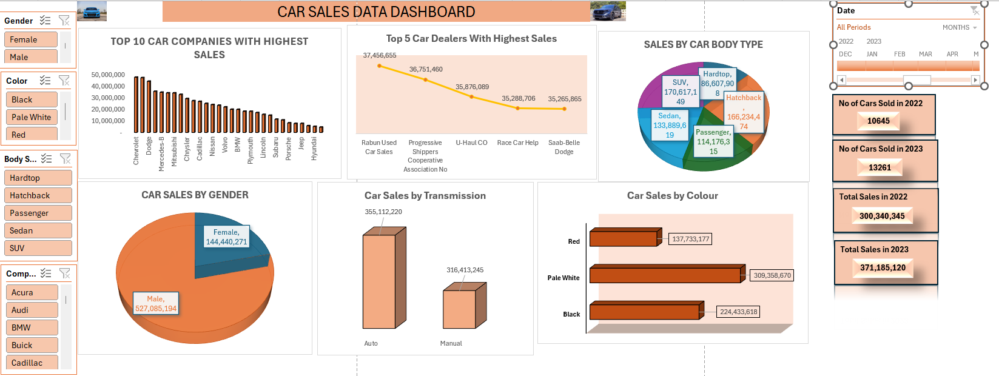

# Data Analytics Portfolio
# Project 1

**Title:** [Car Sales Data Dashboard](https://github.com/sfrempong35-maker/sfrempong35-maker.github.oi/blob/main/Car_saless.xlsx)

**Tool Used:** Microsoft Excel (Pivot Tables, Conditional Formatting, Slicer, Timelines, Pivot Charts)

**Project Description:** This project analyses car sales performance using a dataset containing 23,906 vehicle sales records across 2022 and 2023, with total revenue of $671.5 million. The analysis explores sales trends by year, car company, dealer, gender, transmission type, colour, and body style. I cleaned and structured the dataset, then built pivot-based summaries and an interactive dashboard to highlight key business insights. The dashboard shows top-performing car companies, leading dealers, customer purchase patterns, and yearly sales growth. Key findings include higher total sales in 2023 compared with 2022, strong performance from brands such as Chevrolet and Ford, and higher revenue from automatic transmission vehicles.This project demonstrates skills in Excel data cleaning, pivot tables, dashboard design, sales analysis, data visualisation, and business insight reporting.

**Key findings:** The dataset contains 23,906 car sales records, with total sales revenue of $671.5 million and an average sale value of about $28,090. Sales increased from $300.3 million in 2022 to $371.2 million in 2023, showing growth of about 23.6%. Chevrolet generated the highest revenue at $47.7 million, followed closely by Ford at $47.2 million and Dodge at $44.1 million. Rabun Used Car Sales was the top-performing dealer, generating $37.5 million from 1,313 sales.

Automatic transmission vehicles performed slightly better than manual vehicles, generating $355.1 million, about 52.9% of total revenue.
Male customers accounted for the largest share of sales, contributing $527.1 million, about 78.5% of total revenue.
Pale White was the most popular vehicle colour by revenue, generating $309.4 million. SUVs produced the highest revenue by body style, with $170.6 million in sales, followed by Hatchbacks at $166.2 million.Austin was the strongest dealer region, generating $117.2 million, about 17.5% of total revenue.

**Dashboard Overview:**

# Project 2
**Title:** Pizza Sales Data Interrogation

**SQL Code:** [Pizza Sql  Queries](https://github.com/sfrempong35-maker/sfrempong35-maker.github.oi/blob/main/PIZZA.Sql)

**SQL Skills Used:** Data Retrieval (SELECT): Queried and ectracted specific information from database.

Data Aggregation (SUM, COUNT): Calculated totals, such as sales and quantities, and counted records to analyze data trends.

Data Filtering (WHERE, BETWEEN, IN , AND, GROUP BY): Applied filtrs to slelect relevant data, including filtering by ranges and lists.

Data Source Specification (FROM): Specified the tables used as dara sources for retrieval.

**Project Description:** This project involved analysing a pizza sales dataset using Microsoft SQL Server to extract business insights from customer orders, sales revenue, pizza categories, sizes, and pricing.

The dataset contained key fields such as pizza ID, order ID, pizza name, quantity, order date, order time, unit price, total price, pizza size, pizza category, and pizza ingredients. SQL queries were written to calculate total revenue, total pizzas sold, total number of orders, and sales performance for specific pizza categories and products.

The analysis also explored date-based sales trends, including pizzas ordered in January 2015 and orders placed between November and December 2015. Product-specific queries were used to measure the quantity sold for selected pizzas such as The Hawaiian Pizza, The Greek Pizza, and The Spinach Supreme Pizza. Additional filtering was applied to identify medium-sized pizzas and pizzas with a unit price above 12.5.

This project demonstrates practical SQL skills, including data selection, aggregation, filtering, grouping, date range analysis, and business reporting. The insights produced from the analysis support a better understanding of sales performance, customer purchasing patterns, and product demand within the pizza business.

**Technology Used:** SQL Server

# Project 3

**Title:** Salesman Customer Order Data Inerrogation

**SQL CODE:** [Salesman Customer Order Data](http://github.com/sfrempong35-maker/sfrempong35-maker.github.oi/blob/main/Salesman%20Customer%20Order%20Data%20SQL)

**SQL Skills Used:** Data Retrieval (SELECT): Queried and ectracted specific information from database.

Data Aggregation (SUM, COUNT, JOIN, LEFT JOIN, RIGHT JOIN): Calculated totals, such as sales, quantities, counted records and also joining tables to analyze data trends.

Data Filtering (WHERE, BETWEEN, IN , AND, GROUP BY, ORDER BY): Applied filtrs to select relevant data, including filtering by ranges, lists, grouping data and ordering data.

Data Source Specification (FROM): Specified the tables used as dara sources for retrieval.

**Project Description:**

**Technology Used:**
